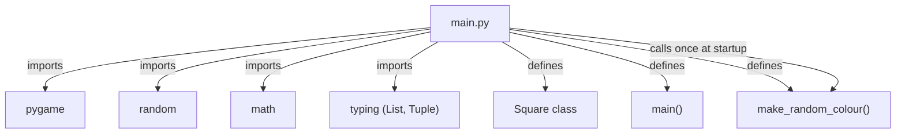
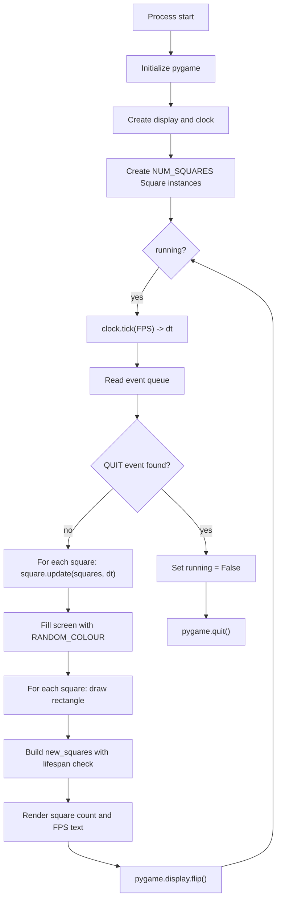
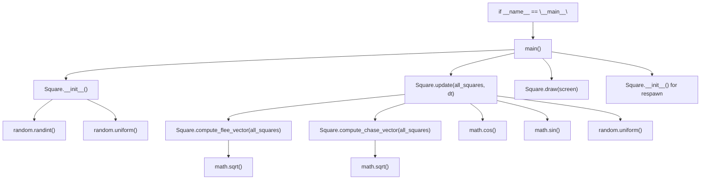
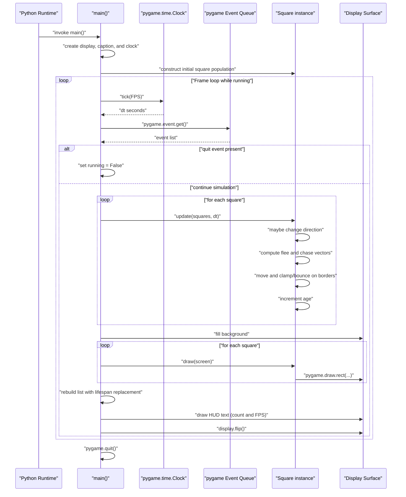

# Architecture Documentation

## Overview

The project is a single-module Pygame simulation centered in `main.py`. It creates a population of `Square` objects that move continuously, change direction at intervals, avoid larger neighbors, chase smaller neighbors, bounce on screen boundaries, and respawn when lifespan expires.

## Dependency Graph

Notes:
- Runtime has no separate package layers; game orchestration and entity logic coexist in one file.
- Global constants configure display, movement, and interaction ranges.

## High-Level Runtime Flow

Notes:
- The frame loop is time-based via $dt=\frac{\text{milliseconds}}{1000}$.
- Expired squares are replaced immediately to keep population size stable.

## Function-Level Call Graph

Notes:
- `Square.update()` is the central behavior aggregator.
- Flee/chase computations scan all squares each frame, creating pairwise interaction cost.

## Primary Execution Sequence

Notes:
- `age` increments in `Square.update()` and again in the lifespan pass in `main()`, effectively doubling age progression per frame.
- Lifespan values are compared against age measured in seconds (since age uses `dt`).

## Data and State Summary

- Global configuration:
  - `SCREEN_WIDTH = 800`, `SCREEN_HEIGHT = 600`, `FPS = 60`
  - `NUM_SQUARES = 50`, `MAX_SPEED = 120`, `DANGER_DISTANCE = 80`
  - `MIN_SIZE = 10`, `MAX_SIZE = 50`
- Per-square mutable state:
  - spatial: `x`, `y`, `angle`
  - appearance: `size`, `color`
  - motion control: `speed`, `direction_timer`, `direction_change_interval`
  - lifecycle: `lifespan`, `age`

## Assumptions

- Architecture reflects only the currently present runtime in `main.py`.
- No persistence, networking, multithreading, or external services are part of the execution path.
