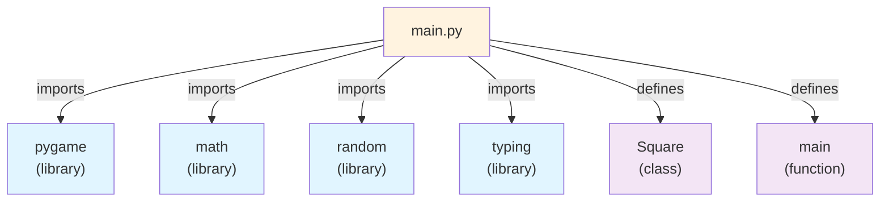
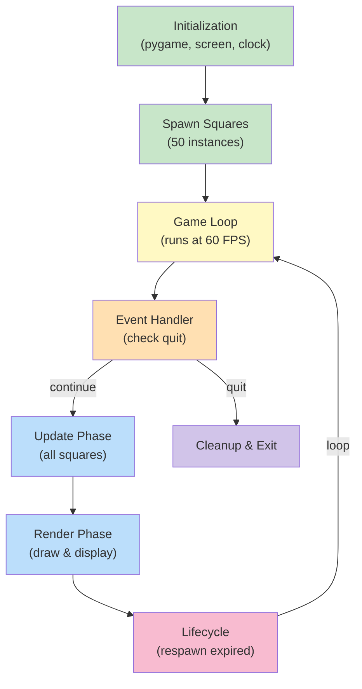
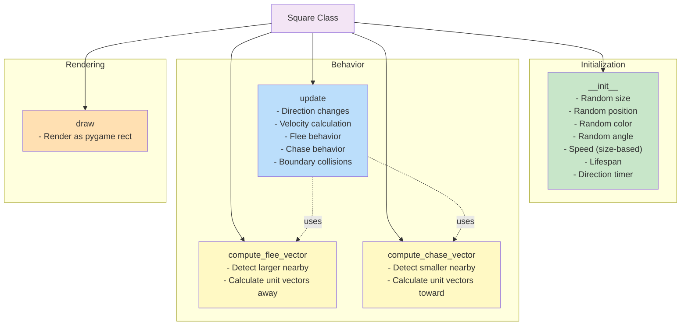
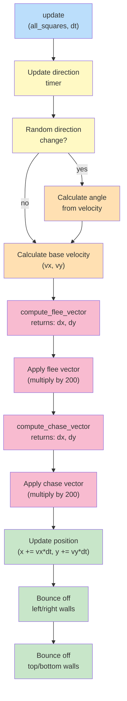
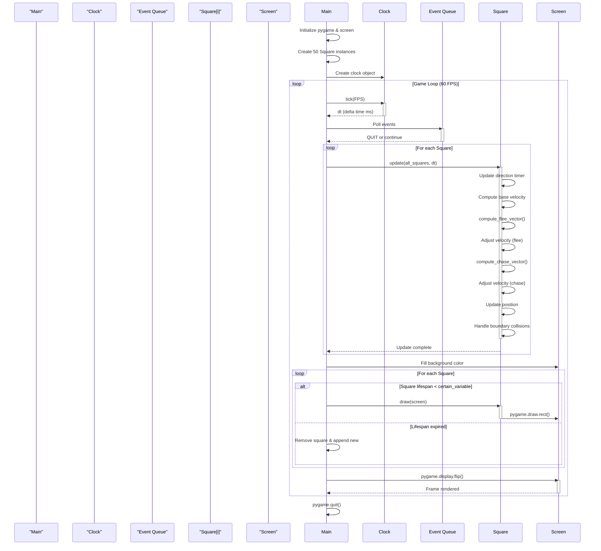
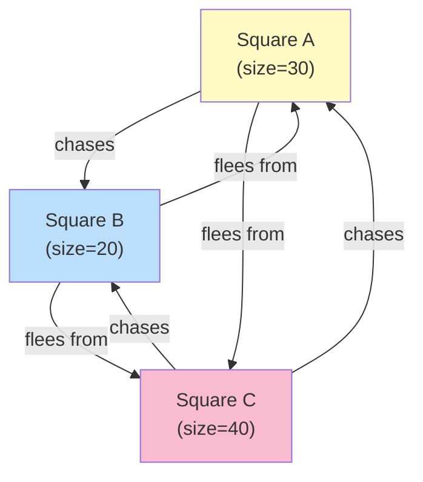
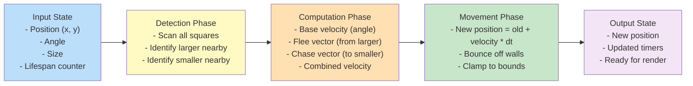

# Pygame Moving Squares - Architecture Documentation

## Overview

This project is a simple Pygame-based simulation featuring multiple animated squares that move around the screen with intelligent behavior: they flee from larger squares and chase smaller ones. The architecture is minimal and focused, with a single main module orchestrating the game loop and a `Square` class handling individual entity behavior.

---

## 1. Module Dependency Graph



**Dependencies:**
- `pygame`: Graphics rendering and event handling
- `math`: Trigonometric calculations for movement vectors
- `random`: Random initialization and variation
- `typing`: Type hints for clarity and IDE support

---

## 2. High-Level System Architecture



**Flow:**
1. **Initialization**: Pygame engine and display initialized, clock created
2. **Spawning**: 50 `Square` instances created with random properties
3. **Game Loop**: Continuous cycle at 60 FPS
4. **Event Handling**: Monitor for quit events
5. **Update**: Each square computes new velocity and position
6. **Render**: Clear screen, draw all active squares, update display
7. **Lifecycle**: Replace expired squares with new ones
8. **Cleanup**: Exit pygame on quit

---

## 3. Square Class Architecture



**Key Attributes:**
- `size`: Random integer (10-50 pixels)
- `x, y`: Screen position (float)
- `color`: RGB tuple (randomized)
- `angle`: Movement direction (radians)
- `speed`: Derived from size (larger = slower)
- `lifespan`: Duration before respawn (30-180 frames)
- `direction_timer`: Accumulator for direction changes

---

## 4. Detailed Call Graph - Square.update()



---

## 5. Sequence Diagram - Primary Execution Path



---

## 6. Behavior Model - Square Interactions



**Interaction Rules:**
- A square **flees** from any square larger than itself within `danger_distance` (50 px)
- A square **chases** any square smaller than itself within `danger_distance` (50 px)
- Flee and chase vectors are normalized and scaled (multiplied by 200 to override base movement)
- Movement is also influenced by random angle changes and boundary collisions

---

## 7. Data Flow - Per-Frame Update



---

## 8. Global Constants & Configuration

| Constant | Value | Purpose |
|----------|-------|---------|
| `SCREEN_WIDTH` | 800 | Display width (px) |
| `SCREEN_HEIGHT` | 600 | Display height (px) |
| `FPS` | 60 | Target frame rate |
| `NUM_SQUARES` | 50 | Initial square count |
| `MAX_SPEED` | 100 | Max velocity (px/s) |
| `danger_distance` | 50 | Detection radius (px) |
| `MIN_SIZE` | 10 | Minimum square size (px) |
| `MAX_SIZE` | 50 | Maximum square size (px) |

---

## 9. Performance Characteristics

- **O(n²) Complexity**: Each square's `update()` iterates through all other squares to compute flee/chase vectors.
- **50 Squares**: ~2,500 distance checks per frame at 60 FPS = ~150,000 checks/sec
- **Optimization Opportunity**: Spatial partitioning (quadtree/grid) could reduce collision checks to O(n log n)

---

## 10. Key Design Decisions

1. **Lifespan-based Lifecycle**: Squares expire after 30-180 frames and are replaced. This ensures dynamic behavior without persistent memory leaks.

2. **Size-based Speed**: Larger squares move slower, making them easier to catch and creating natural game balance.

3. **Random Direction Changes**: Squares periodically randomize their direction (every 0.5-1.5 seconds), preventing deterministic patterns.

4. **Vector Scaling**: Flee and chase vectors are multiplied by 200 to override base random movement, making behavior-driven navigation dominant.

5. **Angle-based Movement**: Uses trigonometry (`cos`/`sin`) for smooth movement in any direction.

---

## Technology Stack

- **Language**: Python 3.x
- **Framework**: Pygame 2.6.1
- **Type Hints**: Enabled (Python 3.5+)
- **Target Platform**: Windows/Linux/macOS (cross-platform)

---

## Entry Point

```python
if __name__ == "__main__":
    main()
```

Execution begins in the `main()` function, which initializes the pygame environment, spawns entities, and runs the continuous game loop until user quits.
